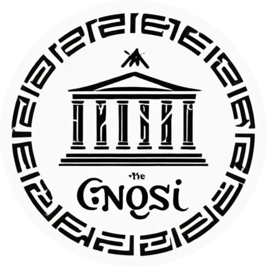

# Gnosi

  

 
O projeto consiste no desenvolvimento de um site voltado para cursos, no qual há a interação entre alunos e professores. Foi desenvolvido um ambiente virtual onde os professores podem cadastrar seus cursos e gerenciar os alunos, enquanto os alunos podem se inscrever, acessar os materiais e acompanhar seu progresso nos cursos disponíveis. O sistema busca facilitar a comunicação e o aprendizado, oferecendo uma interface intuitiva para a gestão das atividades educacionais entre alunos e professores e permitindo a certificação oficial de cursos

## Integrantes

* Bernardo de Resende Marcelino
* Flávio de Souza Ferreira Júnior
* João Marcelo Carvalho Pereira Araújo
* Miguel Figueiredo Diniz
* Maria Clara Gomes Silva de Oliveira
* Thiago Costa Soares
* Kauã Agner Duarte Moura

## Professoras

* Prof. Aline Norberta de Brito 
* Prof. Eveline Alonso Veloso 
* Prof. Juliana Amaral Baroni de Carvalho 

## Instruções de utilização

## Histórico de versões

* 0.1.1
    * CHANGE: Atualização das documentações. Código permaneceu inalterado.
* 0.1.0
    * Implementação da funcionalidade X pertencente ao processo P.
* 0.0.1
    * Trabalhando na modelagem do processo de negócio.

